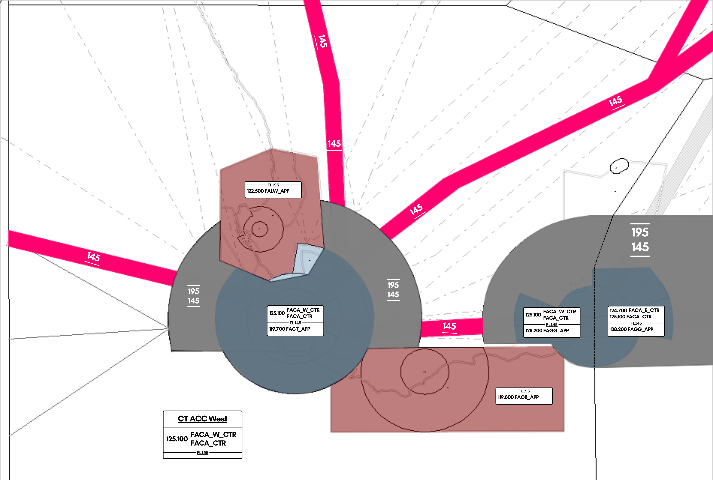

# Cape Town Area (West)

## Inbound / Arrival Clearances

On contact with the first FACA unit (FACA_W) or (FACA_E), the controller will be the one to issue the arrival clearance into Cape Town. Controllers are to check the latest NOTAMs, aswell as the Cape Town TMA page to keep up to date with the latest STARs in use.

!!! note 
    These STARs are also applicable for aircraft flying into Ysterplaat (FAYP)

When giving the arrival clearance, the aircraft should first be cleared inbound into the sector at their current level, before being passed a STAR, landing runway, and ATIS code in range.

!!! info "STAR Clearance Phraseology"
    "(callsign), cleared inbound FL(flight level), (STAR) arrival landing (runway), check ATIS (code) in range."

e.g.

SAA369, cleared inbound FL340, ERDAS1C arrival landing Runway 01, check ATIS B in range.

Should the aircraft either:
* Already have received its STAR clearance for FACT/FAYP from another ATS unit
* Overflying FACA or your sector in general

then the controller should only clear the aircraft at their level.

!!! info "Inbound Phraseology"
    "(callsign), cleared inbound FL(flight level)."

e.g.

SAA369, cleared inbound FL340.

The pilot should read back their cleared level as confirmation.

## Enroute CPDLC / SELCAL
The Cape Town Flight Information Region (FACA) is equipped and is able to operate enroute CPDLC coverage for aircraft operating above FL195, which is built into the sector files through TopSky, and requires an active Hoppie's Code to use.

The following instructions can be transmitted via CPDLC.

* Altitude Change (Climb/Descent)
* Heading Instructions
* Direct To (Fix)

As well as this, TopSky offers the following free text options to be transmitted for FACA-W.
* SERVICE TERMINATED. MONITOR UNICOM 122.800
* SERVICE TERMINATED. SQUAWK 2000. MONITOR UNICOM 122.800
* CERTAIN INSTRUCTIONS UNAVAILABLE VIA DATALINK. PLEASE MONITOR * VOICE AT ALL TIMES
* CPDLC SERVICE TERMINATED. REVERT TO VOICE
* CPDLC SERVICE TERMINATE PASSING FL195. REVERT TO VOICE.
* RADAR SERVICE TERMINATED.
* ALL ATS TERMINATED.
* RADAR CONTACT LOST.
* NO DELAY EXPECTED.
* DELAY NOT DETERMINED.
* REPORT APPROACHING TOP OF DESCENT ON VOICE.
* REPORT APPROACHING TOP OF DESCENT.
* CHECK STUCK MICROPHONE
* CONTINUE PRESENT HEADING
* RESUME NORMAL SPEED
* REPORT YOUR MACH NUMBER.
* REPORT YOUR IAS.
* REQUEST NOT SUPPORTED VIA DATALINK. REVERT TO VOICE.

There is no SELCAL capabilities within the Cape Town FIR.

!!! info
    All arrival clearances are to be transmitted through voice on initial contact. CPDLC may not be used for this function.

## Squawk Allocation

### FACA

**Domestic**

* 0500 - 0577
* 5400 - 5477
* 3100 - 3177
* 4500 - 4577

**International**
* 4700 - 4777

